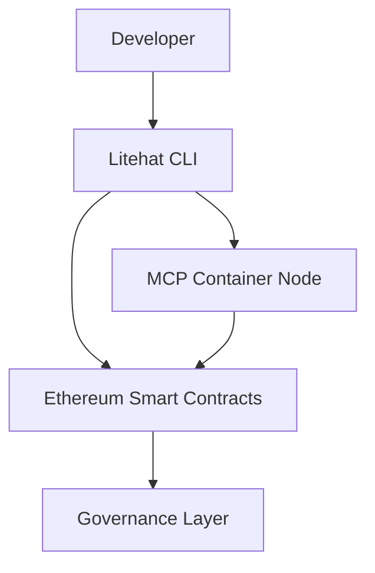

# 🧠 Litehat (LTH)

Decentralized MCP Server Deployment with Ethereum + Secure Containers + On-Chain Governance

---

## 📘 Introduction

Litehat is a decentralized platform for deploying and managing Model Context Protocol (MCP) servers. It combines Ethereum smart contracts with secure container execution and CLI tooling for scalable, auditable AI infrastructure.

---

## ✨ Features

- 🛠 Smart Contracts for on-chain governance  
- 📦 Secure, isolated container-based server deployment  
- 🔐 Secret encryption and access control  
- 🖥 CLI tools for deploy, monitor, governance  
- 📈 Auto-scaling based on demand  
- 🔗 Token-based governance with $LTH  
- 🔌 SDK and API support  
- ☁️ Cloud and on-prem ready  

---

## 📐 Architecture


---

## 🚀 Installation

To install Litehat CLI and set up your environment:

- Clone the Litehat repository
```bash
git clone https://github.com/litehat/LTH.git
cd LTH
```
- Install dependencies
```bash
npm install  # If using Node.js CLI
```
OR
```bash
go install ./cmd/litehat  # If using Go CLI
```
- Set up your environment
```bash
cp .env.example .env
```

---

## ⚙️ Usage
After installation, you can start using Litehat CLI commands:
- Deploy MCP server
```bash
litehat deploy --env test --type mcp --cpu 2 --memory 4GB
```
- Monitor server status
```bash
litehat monitor --id <server_id>
```
- Manage governance proposals
```bash
litehat governance --vote yes --proposal 5
```

---

## ⚙️ Configuration

Configure your Litehat environment by editing the `.env` file or using CLI flags.

Example `.env` variables:

```env
ETHEREUM_RPC_URL=https://mainnet.infura.io/v3/YOUR_INFURA_PROJECT_ID
LTH_PRIVATE_KEY=your_private_key_here
```

---

## 🤝 Contributing

Contributions are welcome! Please fork the repo and create a pull request.

- Follow the existing code style.
- Write clear commit messages.
- Report issues in the GitHub Issues tab.

---

## 🔗 Links
- [Website](https://litehat.ai)
- [Litehat GitHub Repository](https://github.com/litehatfndn/litehat)
- [Documentation](https://docs.litehat.ai)
- [Community Chat](https://t.me/litehat)
